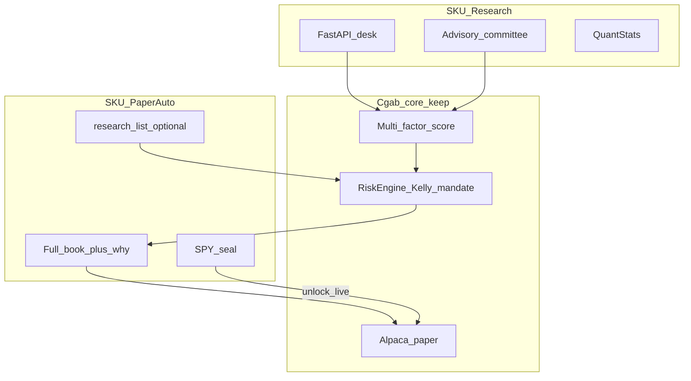

# Cgab — World-class upgrade plan

**Last updated:** 2026-09-12 (review: sequencing corrected)  
**Status:** Operating strategy. **No trading-code changes until you approve a coding slice.**  
**Architecture:** [`ARCHITECTURE_DECISION.md`](ARCHITECTURE_DECISION.md) **ADR-002** (ADR-001 superseded, kept as history).  
**This file is the canonical copy** of the grade, OSS catalog, steal/refuse list, two-SKU design, and slices.

**One-line goal:** sell two functions — (1) world-class stock analysis, (2) a paper-proven auto trader that can go live after evidence — by stealing the right ideas from famous open-source systems without throwing away Cgab’s risk core.

Related: [`AUTO_TRADING_ROADMAP.md`](AUTO_TRADING_ROADMAP.md), [`PAPER_VALIDATION_RUNBOOK.md`](PAPER_VALIDATION_RUNBOOK.md), [`PAID_DATA_PIT_PLAN.md`](PAID_DATA_PIT_PLAN.md), [`PROCUREMENT_GUIDE.md`](PROCUREMENT_GUIDE.md).

---

## 中文摘要

Cgab 作為「能賣的頂級 AI 交易系統」約 **5.8 / 10**。分析約 **7.2**，執行／紙上約 **5.0**，可賣性約 **3.5**。

對 GitHub 明星項目，我們已贏在它們常缺的地方：RiskEngine、授權範圍、急停、Kelly、Alpaca 紙上單、Telegram 選單（不能文字下單）。我們輸在 OpenBB 級工作區、TradingAgents 委員會、Qlib 因子工廠、Worker 每輪只抓 20 檔、Yahoo 為主、沒有帳號隔離與計費。

**星星 ≠ 優勢。** TradingAgents（約 10 萬星）是研究模擬；Qlib／Nautilus／Lean 才是工業杠。整庫推倒重寫會丢掉風控核心，並延後一年才能賣。

兩個產品、同一套核心。產品 UI = FastAPI 桌；Streamlit = 實驗室。不要重寫 RiskEngine、授權、急停、Alpaca，以及「LLM／Telegram 不能下單」。

**2026-09-12 自審結論：** 方向是目前最好的（保核心、兩 SKU、偷機制、真盤有閘）。原先把 FinBERT／委員會／QuantStats 和「拿掉 20 檔上限」捆成同一個 8–12 週 P0，**順序不是最好**。紙上沒買的主因是 `StableStrategy`（RSI 低於 32 + 布林下軌 + SMA200 + 基本面≥65）加上舊的 Scan 過期變 50 分（已改為 as-of／擋 `research_list`、保留真實分數 + 盤中自動掃描），不是缺一個巴菲特 Agent。FinBERT 與委員會後移。擴大宇宙必須限流，不能一次打爆 Yahoo。

立刻能動手（仍等你核准寫程式）：宇宙上限可調＋限流、Why-no-trade 上桌與 Telegram、Scan 過期橫幅、可選 `research_list` 策略（不要默默改掉 Stable）。

---

## Review log — is this the best plan?

**Verdict:** Direction **yes**. Original P0 sequencing **no** — corrected in this revision.

| Question | Answer |
|----------|--------|
| Greenfield rewrite to clone TradingAgents+Qlib+Nautilus? | No. 12–18 months back to a weaker bot. |
| Keep RiskEngine / mandate / kill / Alpaca / no LLM orders? | Yes. That is the unfair advantage vs 100k-star demos. |
| Streamlit as the sold UI (old ADR-001)? | No. FastAPI desk is the product. Streamlit is lab. ADR-001 superseded. |
| Sell live alpha before beating SPY net of costs? | No. Paper 24/5 may be demoed. Customer cash stays gated. |
| First coding work = committee + FinBERT + QuantStats? | No. That is analysis theatre. First: why the paper book does not trade, then analysis SKU. |
| Silently make worker “buy the Scan top 5”? | No. Add a named `research_list` strategy. Keep Stable as mean-reversion. |
| Naive `for ticker in universe` after removing `[:20]`? | No. Configurable cap, batching, backoff. |

Work already done (not new code in this review): Telegram button menu, FastAPI inbox poller, this docs file. Worker still `ticker_universe[:20]`. SQLite order store already exists. `research_stale` is only a log line, not a desk banner.

---

## Constraint and rewrite policy

**Stars ≠ edge.** TradingAgents (~102k) is a demo firm. Qlib / Nautilus / Lean are the industrial bar.

**Rewrite weak layers:** desk UX, factor lab, reports, worker clock/universe/rate limits.  
**Do not rewrite:** RiskEngine, mandate, kill switch, Alpaca adapter, or the rule that LLMs cannot place orders.

**Live vs sell:** 24/5 Alpaca **paper** may be a sales demo. **Customer real-money live** stays gated (beat SPY net of costs, Stage-2 seal, 30-day paper runbook).



---

## Honest grade of Cgab today (out of 10)

Overall vs a **sellable top AI trading system**: **5.8 / 10 (B-)**.

| Pillar | Score | Note |
|--------|------:|------|
| Research / analysis | 7.2 | Deep, Scan 74, DCF, earnings, comps, thesis, 80/20 LLM blend |
| Narrative AI (multi-agent firm) | 4.5 | One overlay on top 15 names; no debate transcript |
| Data / provenance | 5.0 | Yahoo primary, Polygon optional, VADER; PIT is desk-list only |
| Alpha science | 5.5 | Walk-forward exists; hand-weighted fund+tech, not an IC/IR factory |
| Risk design | 7.5 | Kelly, concentration, correlation, daily loss, VIX, kill switch, mandate |
| Execution engine | 5.0 | Alpaca paper/shadow. Weak: **20 tickers/tick**; Stable rarely fires; no backtest=live clock |
| Ops / product UX | 5.5 | Two UIs; Telegram menu started; no why-no-trade on the desk |
| Validation / evidence | 4.5 | Seal tooling exists; SPY excess not a shipped metric |
| Production / tenancy / sellability | 3.5 | No billed multi-tenant SKU; live correctly blocked |

12-month targets: Research **7.2 → 8.5**, alpha **5.5 → 8.0** (or stop claiming alpha), paper ops **5.0 → 8.0**. Live gated.

---

## Famous open-source systems (reference catalog)

Approximate GitHub stars as of Sep 2026. Longer tail: [Awesome_AI4Finance](https://github.com/AI4Finance-Foundation/Awesome_AI4Finance), [awesome-quant](https://github.com/wilsonfreitas/awesome-quant).

### LLM / multi-agent

- [TauricResearch/TradingAgents](https://github.com/TauricResearch/TradingAgents) (~102k) — LangGraph firm; paper [arXiv 2412.20138](https://arxiv.org/pdf/2412.20138)
- [virattt/ai-hedge-fund](https://github.com/virattt/ai-hedge-fund) (~63k)
- [ZhuLinsen/daily_stock_analysis](https://github.com/ZhuLinsen/daily_stock_analysis) (~40k)
- [HKUDS/Vibe-Trading](https://github.com/HKUDS/Vibe-Trading) (~32k)
- [anthropics/financial-services](https://github.com/anthropics/financial-services) (~30k)
- [hsliuping/TradingAgents-CN](https://github.com/hsliuping/TradingAgents-CN) (~28k)
- [HKUDS/AI-Trader](https://github.com/HKUDS/AI-Trader) (~19k)
- [UFund-Me/Qbot](https://github.com/UFund-Me/Qbot) (~18k)
- [AI4Finance-Foundation/FinRobot](https://github.com/AI4Finance-Foundation/FinRobot) (~8k)
- [microsoft/RD-Agent](https://github.com/microsoft/RD-Agent)
- [pipiku915/FinMem-LLM-StockTrading](https://github.com/pipiku915/FinMem-LLM-StockTrading)
- [RL-MLDM/alphagen](https://github.com/RL-MLDM/alphagen)

### AI / ML quant

- [microsoft/qlib](https://github.com/microsoft/qlib) (~47k)
- [OpenBB-finance/OpenBB](https://github.com/OpenBB-finance/OpenBB) (~69k)
- [AI4Finance-Foundation/FinGPT](https://github.com/AI4Finance-Foundation/FinGPT) (~21k)
- [AI4Finance-Foundation/FinRL](https://github.com/AI4Finance-Foundation/FinRL) (~16k) — lab only for us
- [stefan-jansen/machine-learning-for-trading](https://github.com/stefan-jansen/machine-learning-for-trading) (~19k)
- [hudson-and-thames/mlfinlab](https://github.com/hudson-and-thames/mlfinlab) — prefer reimplement
- [ProsusAI/finBERT](https://github.com/ProsusAI/finBERT)

### Execution / bots

- [freqtrade/freqtrade](https://github.com/freqtrade/freqtrade) (~53k)
- [vnpy/vnpy](https://github.com/vnpy/vnpy) (~41k) — skip as core
- [nautechsystems/nautilus_trader](https://github.com/nautechsystems/nautilus_trader) (~26k)
- [QuantConnect/Lean](https://github.com/QuantConnect/Lean) (~20k)
- [polakowo/vectorbt](https://github.com/polakowo/vectorbt), [jesse-ai/jesse](https://github.com/jesse-ai/jesse), [hummingbot/hummingbot](https://github.com/hummingbot/hummingbot)

### Data / risk / reports

- [ranaroussi/yfinance](https://github.com/ranaroussi/yfinance), [akfamily/akshare](https://github.com/akfamily/akshare), [ccxt/ccxt](https://github.com/ccxt/ccxt)
- [dgunning/edgartools](https://github.com/dgunning/edgartools), [JerBouma/FinanceToolkit](https://github.com/JerBouma/FinanceToolkit)
- [ranaroussi/quantstats](https://github.com/ranaroussi/quantstats), [robertmartin8/PyPortfolioOpt](https://github.com/robertmartin8/PyPortfolioOpt)
- [lballabio/QuantLib](https://github.com/lballabio/QuantLib), [goldmansachs/gs-quant](https://github.com/goldmansachs/gs-quant)
- [alpacahq/alpaca-py](https://github.com/alpacahq/alpaca-py)

---

## What to steal — and what to refuse

Steal **mechanisms**, not repos.

### SKU 1 — Analysis

| Source | Steal | Refuse |
|--------|--------|--------|
| OpenBB | Provenance, one-name workspace, connect-once data | Unopinionated data dump |
| TradingAgents / ai-hedge-fund | Roles, bull/bear log | Committee `place_order` |
| daily_stock_analysis | Daily digest + push | Replacing the scorer |
| FinGPT / FinBERT | Domain sentiment (after Slice A) | FinGPT as trading policy |
| QuantStats | Tear sheets vs SPY | Charts without costs |
| edgartools / FinanceToolkit | Filings and ratios | Yahoo headlines as filings |

### SKU 2 — Trading

| Source | Steal | Refuse |
|--------|--------|--------|
| Qlib + RD-Agent | Factor IC/IR, walk-forward; **Cgab Factor Lab** | Full Microsoft transplant year one |
| vectorbt | Fast sweeps | Live engine |
| Nautilus / Lean | Same clock/fills in BT and paper; optional sidecar | Rust/C# rewrite of the desk year one |
| Freqtrade | Dry-run, Telegram, why-no-trade | Becoming a crypto bot |
| FinRL | Lab after measured edge | Year-one live brain |
| vnpy / Hummingbot | Later venue plugins | Core product |

---

## Two products, one core

```text
Cgab Research (SKU A)          Cgab Paper Auto (SKU B)
  FastAPI desk / Deep / Scan     Worker / Alpaca paper
  provenance / tear sheets       why-no-trade / P&L vs SPY
  advisory debate (later)        Stable AND optional research_list
                 \               /
                  Cgab kernel
         score, regime, RiskEngine,
         Kelly, mandate, kill switch
                         |
              Live (SKU C) — not sold unsupervised
```

**LLM rule:** quant + risk decide whether we can trade. LLM explains and may move score by a capped weight (today 20%). No agent or Telegram text can buy.

---

## Upgrade path (corrected sequence)

### Slice A — Paper truth (days, not 8–12 weeks) — first coding when approved

This is the best first move. It does not require FinBERT or a debate UI.

1. Worker universe cap **configurable** (default = full liquid book), with **batching + backoff**. Do not burst 74 Yahoo calls in one loop.
2. **Why-no-trade** codes on worker, desk, and Telegram: `research_stale`, `no_price`, `fund_lt_65`, `rsi_not_oversold`, `bb_not_low`, `below_sma200`, `llm_bearish`, `already_held`, `kill_switch`, `mandate`, `universe_capped`.
3. Desk **scan-age banner** if last scan is past the **session freshness window** (~72h / Fri→Mon safe). Stale = as-of flag: **`research_list` blocks new buys**; **Stable keeps last real fund scores** (no universe-wide rewrite to 50). Missing scan book still defaults to 50.
4. Optional strategy **`research_list`**: RiskEngine-sized buys from fresh Scan top-N. **Stable stays** mean-reversion. Operator chooses. Do not silently replace Stable.
5. **Session-timed auto Scan** (Slice A follow-on): FastAPI lifespan scheduler when `SCAN_AUTO=1` — US Mon–Fri pre-open (~09:20 ET), every `SCAN_INTERVAL_MIN` (default 120) in RTH, post-close (~16:10), LLM on by default. Overlap-safe via `start_scan`. Desk/Telegram show as-of + next scan time.

**Exit:** a stranger can see why there was no fill last night, and can choose Scan-follow vs mean-reversion.

### Slice B — Sellable analysis (weeks)

- New features land on the FastAPI desk first. Streamlit frozen except for critical fixes.
- Provenance chip (vendor, as-of, delay, cache age).
- QuantStats-style tear sheet vs SPY for the paper book and for a ticker.
- Advisory committee on Deep (cost-capped, **not** wired to OrderManager).
- Daily digest using existing Telegram.

**Exit:** Deep on 5 names looks like a memo (thesis, risks, levels, sources).

### Slice C — Alpha factory (weeks, overlap late B)

- Factor IC/IR + walk-forward vs SPY **net of costs**. If it does not beat SPY, SKU B is sold as risk-controlled automation of a research list, not as “alpha.”
- Polygon on the seal path; Yahoo labeled fallback.
- Ranker and worker share the same scores for `research_list`.

**Exit:** dated `performance_research.json` (Sharpe, max DD, turnover, SPY excess).

### Slice D — Bot-grade paper ops

- Next-open ± slippage in backtest and shadow (Shadow 2.0 has pieces).
- Daily P&L vs SPY, last 10 decisions, VPS heartbeat. SQLite ledger already exists.

### Slice E — Optional execution sidecar (months)

- Lean or Nautilus as simulation host only. No Rust rewrite of the desk.
- Broker-native brackets on every entry.

### Slice F — Live (calendar, not a sprint)

- Seal + ≥ 30 trading-day paper checklist + small capital + human week-1.

### Slice G — Commercial

- Accounts, isolation, billing. Analysis first, Auto Paper second, Live last. Not investment advice.

**Deferred on purpose:** FinBERT (after VADER+LLM is on the desk), RD-Agent, options SKU, Streamlit feature-parity project.

---

## What we will not do

- Will not let TradingAgents-style debate **buy**.
- Will not replace RiskEngine with an LLM portfolio manager.
- Will not sell live automation because a GitHub clone has 100k stars.
- Will not switch the core to Freqtrade / vnpy / crypto.
- Will not treat FinRL as the first alpha engine.
- Will not greenfield-rewrite the whole repo.
- Will not delete ADR-001; it is superseded by ADR-002.
- Will not silently turn Stable into “buy the Scan.”

---

## Coding wait-state

**Landed:** ADR-002 docs; Slice A paper-truth (universe cap, why-no-trade, scan banner, `research_list`); session-timed auto Scan + keep-real-scores on stale (no 24h→50).
**Not approved next:** Slice B analysis SKU (provenance, QuantStats, advisory committee).
